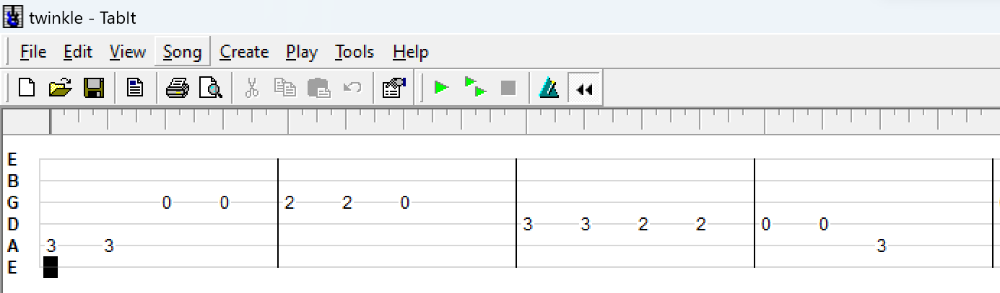
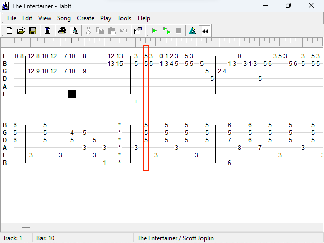

# Description of the .tbt TabIt file format

## Overview

This document describes the format for .tbt files that are opened and saved by TabIt, a Windows application that is described in its website [^1] as

> a full-featured program for creating, playing, and printing guitar, bass, or banjo tablature.

TabIt is effectively abandonware.

The latest version of TabIt, version 2.03, was released in 2006 and was used as a reference for the reverse-engineering work.

The format description was reverse-engineered and this document is not an official specification.

Any deviations in this document from how TabIt actually works are errors in this document and should be brought to the attention of the author.


I am not affiliated with TabIt and I do not own any trademark associated with TabIt.

I am simply a fan who wants to see TabIt live.

Thank you JR.


## Example: Twinkle Twinkle Little Star

Here is a disection of an example file of Twinkle Twinkle Little Star.



You can download the .tbt file [here](twinkle.tbt).

The whole file is 143 bytes and looks like this:
```
T B T o x . . 1 . 6 . . . . . .     54 42 54 6f 78 01 03 31 2e 36 00 0b 00 00 00 00
. . . . . . . . . . . . . . . .     00 00 00 00 00 00 00 00 00 00 00 00 00 00 00 00
. . . . . . . . . . . . . . x .     00 00 00 00 00 00 00 00 00 00 c0 00 b8 00 78 00
. . . . . z y . . . . . . p . .     15 00 00 00 e0 7a 79 15 8f 00 00 00 a2 70 b6 18
x . c . . I ` . . . . . . . . .     78 da 63 93 96 49 60 00 02 07 09 86 ff 0c d8 00
. 1 U . . x . . ` . g ` d $ . .     00 31 55 01 f5 78 da 93 60 e0 67 60 64 24 05 87
2 0 2 0 6 . . q   . c . ? . 7 A     32 30 32 30 36 fb 03 71 20 03 63 83 3f 04 37 41
q . < . . . . . . . . . " . . .     71 c3 3c a8 1c b2 18 08 fb 01 c5 16 22 b1 d1 d5
, . # 7 . L . . 1 . . . T % |       2c c0 23 37 8f 4c fb e6 31 00 00 d3 54 25 7c
```

The first 64 bytes of TabIt files is the header:
```
T B T o x . . 1 . 6 . . . . . .     54 42 54 6f 78 01 03 31 2e 36 00 0b 00 00 00 00
. . . . . . . . . . . . . . . .     00 00 00 00 00 00 00 00 00 00 00 00 00 00 00 00
. . . . . . . . . . . . . . x .     00 00 00 00 00 00 00 00 00 00 c0 00 b8 00 78 00
. . . . . z y . . . . . . p . .     15 00 00 00 e0 7a 79 15 8f 00 00 00 a2 70 b6 18
```

Then the metadata, which is a zlib stream:
```
x . c . . I ` . . . . . . . . .     78 da 63 93 96 49 60 00 02 07 09 86 ff 0c d8 00
. 1 U . .                           00 31 55 01 f5
```

Then the body, which is also a zlib stream:
```
x . . ` . g ` d $ . . 2 0 2 0 6     78 da 93 60 e0 67 60 64 24 05 87 32 30 32 30 36
. . q   . c . ? . 7 A q . < . .     fb 03 71 20 03 63 83 3f 04 37 41 71 c3 3c a8 1c  
. . . . . . . " . . . , . # 7 .     b2 18 08 fb 01 c5 16 22 b1 d1 d5 2c c0 23 37 8f
L . . 1 . . . T % |                 4c fb e6 31 00 00 d3 54 25 7c
```

After inflating, the uncompressed metadata looks like this:
```
. . . ` . . . . @ . . . . . . .     06  1b  1c  60  00  00  00  00  40  18  00  ff  00  00  00  00
. . . . . . . . . . . . . . . .     00  00  00  00  00  00  00  00  00  00  00  00  00  00  00  00
.                                   00
```

And after inflating, the uncompressed body looks like this:
```
. . . . . . . . . . . . . . . .     18  00  0f  00  01  01  0f  00  01  01  0f  00  01  01  0f  00
. . . . . . . . . . . . . . . .     01  01  0f  00  01  01  0f  00  01  01  0f  00  01  01  0f  00
. . . . . . . . . . . . . . . .     01  01  0f  00  01  01  0f  00  01  01  0f  00  01  01  0f  00
. . U . . . . . O . . . Q . . .     01  01  55  00  01  00  01  83  4f  00  01  83  51  00  01  80
O . . . O . . . O . . . O . . .     4f  00  01  80  4f  00  01  82  4f  00  01  82  4f  00  01  80
. . . . O . . . O . . . O . . .     9e  00  01  83  4f  00  01  83  4f  00  01  82  4f  00  01  82
O . . . O . . . N . . . . . . .     4f  00  01  80  4f  00  01  80  4e  00  01  83  a1  00  01  80
O . . . N . . . O . . . O . . .     4f  00  01  80  4e  00  01  83  4f  00  01  83  4f  00  01  82
O . . . O . . . . . . . O . . .     4f  00  01  82  4f  00  01  80  a0  00  01  80  4f  00  01  80
N . . . O . . . O . . . O . . .     4e  00  01  83  4f  00  01  83  4f  00  01  82  4f  00  01  82
O . . . . . . . O . . . Q . . .     4f  00  01  80  9e  00  01  83  4f  00  01  83  51  00  01  80
O . . . O . . . O . . . O . . .     4f  00  01  80  4f  00  01  82  4f  00  01  82  4f  00  01  80
. . . . O . . . O . . . O . . .     9e  00  01  83  4f  00  01  83  4f  00  01  82  4f  00  01  82
O . . . O . . . N . . . . .         4f  00  01  80  4f  00  01  80  4e  00  01  83  9e  00
```

The uncompressed body has 2 sections.

This is the bars section of the body:
```
. . . . . . . . . . . . . . . .     18  00  0f  00  01  01  0f  00  01  01  0f  00  01  01  0f  00
. . . . . . . . . . . . . . . .     01  01  0f  00  01  01  0f  00  01  01  0f  00  01  01  0f  00
. . . . . . . . . . . . . . . .     01  01  0f  00  01  01  0f  00  01  01  0f  00  01  01  0f  00
. .                                 01  01
```

And this is the notes section of the body:
```
U . . . . . O . . . Q . . . O .     55  00  01  00  01  83  4f  00  01  83  51  00  01  80  4f  00
. . O . . . O . . . O . . . . .     01  80  4f  00  01  82  4f  00  01  82  4f  00  01  80  9e  00
. . O . . . O . . . O . . . O .     01  83  4f  00  01  83  4f  00  01  82  4f  00  01  82  4f  00
. . O . . . N . . . . . . . O .     01  80  4f  00  01  80  4e  00  01  83  a1  00  01  80  4f  00
. . N . . . O . . . O . . . O .     01  80  4e  00  01  83  4f  00  01  83  4f  00  01  82  4f  00
. . O . . . . . . . O . . . N .     01  82  4f  00  01  80  a0  00  01  80  4f  00  01  80  4e  00
. . O . . . O . . . O . . . O .     01  83  4f  00  01  83  4f  00  01  82  4f  00  01  82  4f  00
. . . . . . O . . . Q . . . O .     01  80  9e  00  01  83  4f  00  01  83  51  00  01  80  4f  00
. . O . . . O . . . O . . . . .     01  80  4f  00  01  82  4f  00  01  82  4f  00  01  80  9e  00
. . O . . . O . . . O . . . O .     01  83  4f  00  01  83  4f  00  01  82  4f  00  01  82  4f  00
. . O . . . N . . . . .             01  80  4f  00  01  80  4e  00  01  83  9e  00
```


## Terminology

A "space" is a slice of notes at one instant of time.



A space is typically one 1/16th note in TabIt. A 1/16th note is sometimes called a "semi-quaver".

A space may have different notes and also different effects such as a hammer-on, tap, harmonic, etc.

In order to store these in a single space, it is necessary to sub-divide a space into 20 separate "slots" where notes and effects may be stored.

Incrementing through slots is measured in "vsqs" which is short for "viginti-semi-quaver" which means 1/20 of 1/16th note.

For example, the A string and D string are next to each other and when incrementing from a note on the A string to a note on the D string, the increment is 1 vsq.

In other situations, it is necessary to sub-divide a space into only 2 parts, and these parts are called "dsqs", which is short for "demi-semi-quaver" which means = 1/2 of 1/16th notes.


## Versions

Different versions of TabIt may save to the same file format version.

This document deals with version numbers encoded in .tbt files and doesn't talk about versions of the TabIt product itself.

Relatedly, TabIt files store both a version number and a version string.

The version string may be the same for different version numbers.

To be completely accurate, this document will refer to version numbers only.

Files stored with version number `0x68` store version string "1.22".

Files stored with version number `0x6e` store version string "1.55".

Files stored with version number `0x6f` store version string "1.6".

Files stored with version number `0x70` store version string "2.0".

Files stored with version number `0x71` store version string "2.0".

Files stored with version number `0x72` store version string "2.0".

The version strings correspond roughly to released versions of TabIt.


Version `0x6a` added "display MIDI note numbers" and MIDI channel.

Version `0x6b` increased the number of allowed strings to 8, and added pan and highest note.

Version `0x6c` added reverb and chorus.

Version `0x6d` added "transpose half steps" and MIDI bank, and album and transcribedBy.

Version `0x6f` increased the number of allowed spaces from 4000 to 32000.

Version `0x70` added alternate time regions.

Version `0x71` added added modulation, pitch bend, multiple changes at same time.

Note that `0x71` is "unstable" meaning that resaving `0x71` files saves them as `0x72` files.


## Sizes of things

TabIt supports up to 15 tracks.

Each track may have up to 32000 spaces.

Each track may have up to 8 strings.

The highest note on each string may be 99.


## Data structures and endianness

The integers stored in .tbt files are stored little-endian.

A 1-byte integer will be referred to as a "byte".

A 2-byte integer will be referred to as a "short".

A 4-byte integer will be referred to as an "int".

Strings in .tbt files are stored as Pascal strings.

Pascal strings store their length first and lengths will be a byte or a short, depending on use.

There are Pascal1 strings and Pascal2 strings.

Pascal1 strings store their length as a byte.

Pascal2 strings store their length as a short.

A "chunk" is a stream of bytes with its length provided at the beginning.

"chunks" are blobs of binary data that store their length first and lengths will be a short or an int, depending on use.

There are chunk2s and chunk4s.

chunk2s have 2 bytes at the beginning that signify how many shorts to read.

chunk4s have 4 bytes at the beginning that signify how many bytes to read.

zlib streams are blobs of binary data that must be inflated with zlib. All zlib streams in .tbt files begin with the bytes `0x78 0xda`, which come from zlib and mean that best compression was used.

An "array list" is a stream of structured data that can be iterated through and may also be indexed.

A "delta list" uses a kind of delta encoding and is iterated through, but cannot be meaningfully indexed.


## A note on iterating through delta lists

Iterating through delta lists happens a few times in TabIt files.

Delta lists use an increment that is delta encoded and a payload.

Delta lists use a simple scheme for encoding variable-length increments.

If the first byte read is anything other than `00` then, that byte is the increment.

If the first byte read is `00`, then this means to read the next 2 bytes as a short, and that is the increment.

For example, the bytes `01 83` mean to increment `01` byte and fill-in the skipped bytes with value `83`.

And the bytes `00 21 01 02` mean to increment 289 (which is the value of `21 01` as a short) and fill-in with the value `02`.

The bytes `4f 00` mean to increment `4f` bytes and fill-in with value `00`.

Here is the delta list for the notes section of the Twinkle example:
```
. . . . O . . . Q . . . O . . .     01  00  01  83  4f  00  01  83  51  00  01  80  4f  00  01  80
O . . . O . . . O . . . . . . .     4f  00  01  82  4f  00  01  82  4f  00  01  80  9e  00  01  83
O . . . O . . . O . . . O . . .     4f  00  01  83  4f  00  01  82  4f  00  01  82  4f  00  01  80
O . . . N . . . . . . . O . . .     4f  00  01  80  4e  00  01  83  a1  00  01  80  4f  00  01  80
N . . . O . . . O . . . O . . .     4e  00  01  83  4f  00  01  83  4f  00  01  82  4f  00  01  82
O . . . . . . . O . . . N . . .     4f  00  01  80  a0  00  01  80  4f  00  01  80  4e  00  01  83
O . . . O . . . O . . . O . . .     4f  00  01  83  4f  00  01  82  4f  00  01  82  4f  00  01  80
. . . . O . . . Q . . . O . . .     9e  00  01  83  4f  00  01  83  51  00  01  80  4f  00  01  80
O . . . O . . . O . . . . . . .     4f  00  01  82  4f  00  01  82  4f  00  01  80  9e  00  01  83
O . . . O . . . O . . . O . . .     4f  00  01  83  4f  00  01  82  4f  00  01  82  4f  00  01  80
O . . . N . . . . .                 4f  00  01  80  4e  00  01  83  9e  00
```

Here is a better visualization of the same bytes:
```
. .         01  00
. . O .     01  83  4f  00
. . Q .     01  83  51  00
. . O .     01  80  4f  00
. . O .     01  80  4f  00
. . O .     01  82  4f  00
. . O .     01  82  4f  00
. . . .     01  80  9e  00
. . O .     01  83  4f  00
. . O .     01  83  4f  00
. . O .     01  82  4f  00
. . O .     01  82  4f  00
. . O .     01  80  4f  00
. . N .     01  80  4e  00
. . . .     01  83  a1  00
. . O .     01  80  4f  00
. . N .     01  80  4e  00
. . O .     01  83  4f  00
. . O .     01  83  4f  00
. . O .     01  82  4f  00
. . O .     01  82  4f  00
. . . .     01  80  a0  00
. . O .     01  80  4f  00
. . N .     01  80  4e  00
. . O .     01  83  4f  00
. . O .     01  83  4f  00
. . O .     01  82  4f  00
. . O .     01  82  4f  00
. . . .     01  80  9e  00
. . O .     01  83  4f  00
. . Q .     01  83  51  00
. . O .     01  80  4f  00
. . O .     01  80  4f  00
. . O .     01  82  4f  00
. . O .     01  82  4f  00
. . . .     01  80  9e  00
. . O .     01  83  4f  00
. . O .     01  83  4f  00
. . O .     01  82  4f  00
. . O .     01  82  4f  00
. . O .     01  80  4f  00
. . N .     01  80  4e  00
. . . .     01  83  9e  00
```

We can step through the process of iterating through this delta list.

To start, `vsqCount = 0`.

Read `01 00`, so `notes[0] = 0x00` and `vsqCount += 0x01 (vsqCount == 1)`.

Read `01 83`, so `notes[1] = 0x83` and `vsqCount += 0x01 (vsqCount == 2)`.

Read `4f 00`, so `notes[2...80] = 0x00` and `vsqCount += 0x4f (vsqCount == 81)`.

Read `01 83`, so `notes[81] = 0x83` and `vsqCount += 0x01 (vsqCount == 82)`.

Read `51 00`, so `notes[82...162] = 0x00` and `vsqCount += 0x51 (vsqCount == 163)`.

And so on.

Delta encoding allows for good compression because of repeated structure in the data.


## Structure

The structure of all TabIt files follows this sequence of parts:

1. Header
1. Metadata
1. Body


### Header

The first 64 bytes of a .tbt file is the header.

```
0x00: magic (3 bytes)
0x03: versionNumber: byte
0x04: tempo1: byte
0x05: trackCount: byte
0x06: versionString (Pascal1 string)
0x0b: featureBitfield: byte
0x0c: unused (28 bytes)
0x28: barCountGE70: short
0x2a: spaceCount6f: short
0x2c: lastNonEmptySpaceLE6f: short
0x2e: tempo2: short
0x30: metadataLen: int
0x34: crc32Body: int
0x38: totalByteCount: int
0x3c: crc32Header: int
```

The `magic` bytes for .tbt files are `0x54 0x42 0x54` which are ASCII values for `TBT`.

The `versionNumber` byte is a value such as `0x6f` or `0x72`.

If the tempo of the song is less than `250`, then `tempo1` is set to that value.

The `trackCount` is the number of tracks in the song.

`versionString` is a string with a value such as `1.55` or `2.0`.

`featureBitfield` sets individual bits according to certain features.
```
76543210
       ^
       1: always set, possibly related to having string metadata
      2: always set, purpose unknown
     4: seems to only be present in 0x6f files, does not survive being resaved
    8: always set, possibly related to having metadata
   10: has alternate time regions
  20: unused
 40: unused
80: unused
```

`featureBitfield` is usually `0b00001011`, but may be `0b00011011`, depending on whether there are alternate time regions.


If `versionNumber <= 0x70`, `barCountGE70` is the number of bars in the song.

If `versionNumber == 0x6f`, `spaceCount6f` is the number of spaces in the song.

If `versionNumber <= 0x6f`, `lastNonEmptySpaceLE6f` is the last non-empty space in the song.

`tempo2` is the tempo of the song.

`metadataLen` is the length of the metadata.

`crc32Body` is the CRC-32 of the body.

`totalByteCount` is the total number of bytes in the file.

`crc32Header` is the CRC-32 of the header (first 60 bytes).


### Metadata

Metadata is a zlib stream that must be inflated.

Number of bytes in the metadata stream is specified with `metadataLen` in the header.

After inflating, read the bytes according to this pseudo-code:
```
if 0x70 <= versionNumber:
  spaceCountBlock = read(4 * trackCount)

stringCountBlock = read(1 * trackCount)
cleanGuitarBlock = read(1 * trackCount)
mutedGuitarBlock = read(1 * trackCount)
volumeBlock = read(1 * trackCount)

if 0x71 <= versionNumber:
  modulationBlock = read(1 * trackCount)
  pitchBendBlock = read(2 * trackCount)

if 0x6d <= versionNumber:
  transposeHalfStepsBlock = read(1 * trackCount)
  midiBankBlock = read(1 * trackCount)

if 0x6c <= versionNumber:
  reverbBlock = read(1 * trackCount)
  chorusBlock = read(1 * trackCount)

if 0x6b <= versionNumber:
  panBlock = read(1 * trackCount)
  highestNoteBlock = read(1 * trackCount)

if 0x6a <= versionNumber:
  displayMIDINoteNumbersBlock = read(1 * trackCount)
  midiChannelBlock = read(1 * trackCount)

topLineTextBlock = read(1 * trackCount)
bottomLineTextBlock = read(1 * trackCount)

if 0x6b <= versionNumber:
  tuningBlock = read(8 * trackCount)
else:
  tuningBlock = read(6 * trackCount)

drumBlock = read(1 * trackCount)

if 0x6d <= versionNumber:
  title = read(Pascal2 string)
  artist = read(Pascal2 string)
  album = read(Pascal2 string)
  transcribedBy = read(Pascal2 string)
  comment = read(Pascal2 string)
else:
  title = read(Pascal2 string)
  artist = read(Pascal2 string)
  comment = read(Pascal2 string)
```

`spaceCountBlock` is the number of spaces for each track, stored as an int.

`stringCountBlock` is the number of strings for each track, stored as a byte.

`cleanGuitarBlock` is the MIDI program number for clean guitar for each track, stored as a byte.

Use bit mask `0b10000000` to determine the Dont Let Notes Ring flag.
Use bit mask `0b01111111` to determine the actual MIDI program number.

If Dont Let Notes Ring flag is `1`, then each string rings until the next event on ANY string.

If Dont Let Notes Ring flag is `0`, then each string rings independently until the next event on THAT string.

The MIDI program number is something like 27 for Electric Guitar (clean).

`mutedGuitarBlock` is the MIDI program number for muted guitar for each track, stored as a byte.
mutedGuitarBlock seems to be unused. Older files can have non-default values for muted guitar, but there is no way to edit with the latest version of TabIt.


`volumeBlock` is the volume for each track, stored as a byte.

`modulationBlock` is the modulation effect for each track, stored as a byte.

`pitchBendBlock` is the pitch bend effect for each track, stored as a short.

`transposeHalfStepsBlock` is the number of half-steps to transpose for each track, stored as a byte.

`midiBankBlock` is the MIDI bank number to use for each track, stored as a byte.

`midiBank` can range from 0 to 127.

`reverbBlock` is the reverb effect for each track, stored as a byte.

`chorusBlock` is the chorus effect for each track, stored as a byte.

`panBlock` is the pan effect for each track, stored as a byte.

`highestNoteBlock` is the highest allowed note for each track, stored as a byte.

`displayMIDINoteNumbersBlock` controls whether to display MIDI note numbers for each track, stored as a byte.

`midiChannelBlock` is the MIDI channel for each track, stored as a byte.

`midiChannel` can be -1, which means "Automatically assign", or can be: 1, 2, 3, 4, 5, 6, 7, 8, 9, 10 (Drums), 11, 12, 13, 14, 15, 16.

`topLineTextBlock` controls whether there is text at the top of each track, stored as a byte.

`bottomLineTextBlock` controls whether there is text at the bottom of each track, stored as a byte.

`tuningBlock` is the difference in standard tuning for each string for each track, stored as a byte.

`drumBlock` controls whether the track is a drum track for each track, stored as a byte.

`title` is the title of the song.

`artist` is who wrote or created the song.

`album` is the album that the song was on.

`transcribedBy` is who transcribed the song into TabIt.

`comment` is a text field for comments such as lyrics.


### Body

Body is a zlib stream that must be inflated.

Number of bytes in the body stream is the number of remaining bytes in the file, which can be computed from `totalByteCount - 64 - metadataLen`.

The body has this sequence of parts:

1. Bars
1. Notes
1. Alternate time regions (optional)
1. Track effect changes (optional)


### Bars

Bars are stored differently depending on the version:
```
if 0x70 <= versionNumber:
  bars = read(barCountGE70 * 6)
else:
  bars = read(chunk2)
```

The spaces being processed by bars do not have any knowledge of alternate time regions.

The spaces in bars are as if there are NO alternate time regions.


Alternate time regions are specified per-track and are made to match the spaces in bars.


#### 0x70 and newer

For version `0x70` and newer, `bars` is an array list of 6 byte records with this structure:

`s3 s2 s1 s0 c v`

The bytes `s3 s2 s1 s0` are an int that specifies how many spaces to increment after this bar.

`c` is a byte that is bit-masked with these values do determine which bar lines to make.
```
0b00000000 = single bar line at beginning of bar
0b00000001 = double bar line at beginning of bar
0b00000010 = open repeat at beginning of bar
0b00000100 = close repeat at end of bar
```

And if there is a close repeat at end of bar, then `v` specifies the number of repeats.

The number of spaces in `barsStruct` can be used as the "plain" number of spaces for the song, with no alternate time regions.


#### 0x6f and older

For version `0x6f` and older, `bars` is a chunk2.

After reading the chunk2, there is a delta list that is iterated through.

Each byte in the expanded delta list corresponds to a space and is bit-masked with these values do determine which bar lines to make.
```
0x00001111 = determines which change to make
0x11110000 = when inserting end repeat, specifies how many repeats
```

After bitmasking with `0x00001111`, the value determines which bar lines to make.
```
0 = skip
1 = insert single bar line
2 = insert end repeat
3 = insert start repeat
4 = insert double bar line
```

Single bar line is inserted between CURRENT and NEXT spaces.

Open repeat is inserted between PREVIOUS and CURRENT spaces.

Close repeat is inserted between CURRENT and NEXT spaces.

It is as if each space has only 1 slot, so no need to compute it.


### Notes

For each track, notes are stored in a sequence of chunk2s, and can be read with this pseudo-code:
```
noteList = new list
while True:
  chunk = read(chunk2)
  noteList.append(chunk)
  vsqCount = countVSQ(noteList)
  if vsqCount == 20 * spaceCount:
    break
```

After a complete note list is created, then this is a delta list that is iterated through.

Each byte in the expanded delta list corresponds to a value for the current vsq index.

The current slot is computed by `vsqIndex % 20`.

#### Slots 0 to 7

Note values between `0x80` and `0xe3` correspond to the note values on strings.

For example, value `0x80` in slot 0 means a 0 note on the low E string. A value of `0x85` in slot 1 means a 5 note on the A string.

Drums may have higher numbers than the usual number of frets on guitar strings. The max note is 99, so the highest note value is `0x80` + 99 == `0xe3`.

Besides note values, `0x11` is used for mute string (shown as `x` in TabIt) and `0x12` for stop string (shown as `*` in TabIt).

A muted string plays for a 1/128 note.


#### Slots 8 to 15

These are effects for each string. Slot 8 is the effects for string 0, slot 9 is the effects for string 1, etc.

The effect values:
```
0x00: Skip (no effect)
0x28 ('('): Soft
0x2f ('/'): Slide up
0x3c ('<'): Harmonic
0x5c ('\'): Slide down
0x5e ('^'): Bend up
0x62 ('b'): Bend
0x68 ('h'): Hammer on
0x70 ('p'): Pull off
0x72 ('r'): Release bend
0x73 ('s'): Slap
0x74 ('t'): Tap
0x77 ('w'): Whammy bar bend
0x7b ('{'): Tremolo
0x7e ('~'): Vibrato
```

#### Slot 16

These are track effects.

These are only set when `versionNumber <= 0x70`.

```
0x00: Skip (no effect)
0x43 ('C'): Chorus change
0x44 ('D'): Stroke down
0x49 ('I'): Instrument change
0x50 ('P'): Pan change
0x52 ('R'): Reverb change
0x54 ('T'): Tempo change
0x55 ('U'): Stroke up
0x56 ('V'): Volume change
0x74 ('t'): Tempo change + 250
```

#### Slot 17

Single ASCII character for top line text


#### Slot 18

Single ASCII character for bottom line text


#### Slot 19

The change value for effects or track effects


### Alternate Time Regions

`featureBitfield` from header should be bit-masked with `0b00010000` to determine if there are alternate time regions.

If not, then skip this section.

For each track, Alternate Time Regions are stored in a sequence of chunk2s, and can be read with this pseudo-code:
```
alternateTimeRegionList = new list
while True:
  chunk = read(chunk2)
  noteList.append(chunk)
  dsqCount = countDSQ(noteList)
  if dsqCount == 2 * spaceCount:
    break
```

After a complete alternate time region list is created, then this is a delta list that is iterated through.

Each byte in the expanded delta list corresponds to a value for the current vsq index.

The current slot is computed by `vsqIndex % 2`.

For slot 0:
This is the denominator. For triplets, this is 2.

For slot 1:
This is the numerator. For triplets, this is 3.


### Track Effect Changes

If `versionNumber` is `0x70` or below, then skip this section.

For each track, Track Effect Changes are stored as a chunk4.

After reading the chunk4, there is an array list that is iterated through.

Each entry in the list is an 8 byte structure:
`s1 s0 e1 e0 r1 r0 v1 v0`

`s1 s0` is a short that specifies how many spaces to increment after this word.

`e1 e0` is a short that specifies the effect to change.

`r1 r0` is a short and reserved and always 0.

`v1 v0` is a short that is the value of the effect change.


Track Effects are numbered:
```
1 = Stroke down
2 = Stroke up
3 = Tempo
4 = Instrument
5 = Volume
6 = Pan
7 = Chorus
8 = Reverb
9 = Modulation
10 = Pitch bend
```


<!--
## describe the clever bits
-->


## How did I do it?

Since I have a copy of TabIt and I can run it, then an easy approach is to save different files while changing only 1 thing and see what the difference is.

For example, putting the notes `012345` on low E string, then putting the notes `012345` on the A string, and seeing how the files differ.

Change the tempo, then resave, and see how the files differ.

etc.

It will take a lot of work!


## Special Thanks

Thank you to @foone for the Twitter thread on reverse-engineering SkiFree:
[https://twitter.com/Foone/status/1536053690368348160](https://twitter.com/Foone/status/1536053690368348160)

Thank you to rattle for writing about reverse-engineering Delphi binaries:
[https://blag.nullteilerfrei.de/2019/12/23/reverse-engineering-delphi-binaries-in-ghidra-with-dhrake/](https://blag.nullteilerfrei.de/2019/12/23/reverse-engineering-delphi-binaries-in-ghidra-with-dhrake/)


<!--
that link talking about magic bytes and 78 DA
https://tstillz.medium.com/basic-static-analysis-part-1-9c24497790b6
-->


## References

[^1]: [http://www.tabit.net/](http://www.tabit.net/)


