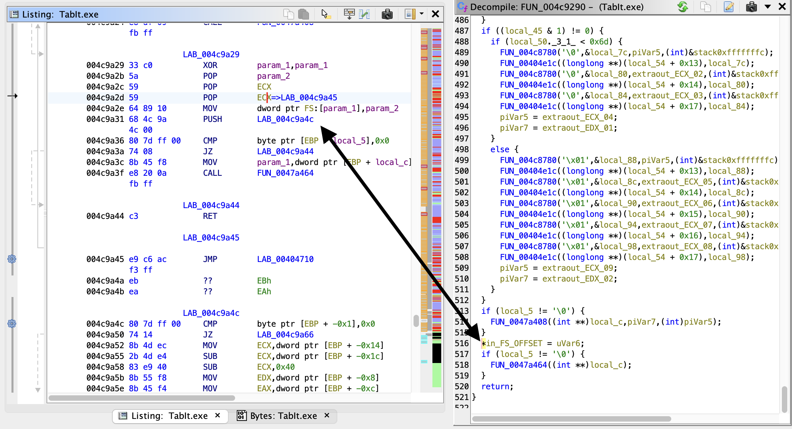

# Reverse-engineering Tabit journal


* jul 17 2022

trying to use Ghidra

already gettings errors when importing .exe

```

2022-07-16 16:16:47 ERROR (ResourceDataDirectory) Invalid resource data: Name cannot end with a delimiter: Program Information. in Options  java.lang.IllegalArgumentException: Name cannot end with a delimiter: Program Information. in Options 
	at ghidra.framework.options.AbstractOptions.validateOptionName(AbstractOptions.java:721)
	at ghidra.framework.options.AbstractOptions.getOption(AbstractOptions.java:215)
	at ghidra.framework.options.AbstractOptions.putObject(AbstractOptions.java:295)
	at ghidra.framework.options.AbstractOptions.setString(AbstractOptions.java:529)
	at ghidra.framework.options.SubOptions.setString(SubOptions.java:227)
	at ghidra.app.util.bin.format.pe.ResourceDataDirectory.processVersionInfo(ResourceDataDirectory.java:433)
	at ghidra.app.util.bin.format.pe.ResourceDataDirectory.markup(ResourceDataDirectory.java:373)
	at ghidra.app.util.opinion.PeLoader.load(PeLoader.java:138)
	at ghidra.app.util.opinion.AbstractLibrarySupportLoader.doLoad(AbstractLibrarySupportLoader.java:347)
	at ghidra.app.util.opinion.AbstractLibrarySupportLoader.loadProgram(AbstractLibrarySupportLoader.java:83)
	at ghidra.app.util.opinion.AbstractProgramLoader.load(AbstractProgramLoader.java:112)
	at ghidra.plugin.importer.ImporterUtilities.importSingleFile(ImporterUtilities.java:404)
	at ghidra.plugin.importer.ImporterDialog.lambda$okCallback$7(ImporterDialog.java:350)
	at ghidra.util.task.TaskBuilder$TaskBuilderTask.run(TaskBuilder.java:306)
	at ghidra.util.task.Task.monitoredRun(Task.java:134)
	at ghidra.util.task.TaskRunner.lambda$startTaskThread$0(TaskRunner.java:106)
	at java.base/java.util.concurrent.ThreadPoolExecutor.runWorker(ThreadPoolExecutor.java:1136)
	at java.base/java.util.concurrent.ThreadPoolExecutor$Worker.run(ThreadPoolExecutor.java:635)
	at java.base/java.lang.Thread.run(Thread.java:833)
```

2022-07-16	16:16:47	ERROR	(ResourceDataDirectory) Invalid resource data: Name cannot end with a delimiter: Program Information. in Options  java.lang.IllegalArgumentException: Name cannot end with a delimiter: Program Information. in Options


there are mentions of `VS_VERSION_INFO` in functions up the stack, so let's get a tool that can dump out info about the PE file

so look into:

https://github.com/trailofbits/pe-parse

guess I'm building ghidra in order to log more info!

so it looks like there is padding that ghidra is not taking into account

padding between ChildrenStringFileInfo and ChildrenVarFileInfo

padding between Strings

padding is not described here:
https://docs.microsoft.com/en-us/windows/win32/menurc/vs-versioninfo


* jul 18 2022

getting closer

```
2022-07-18 11:09:56 INFO  (XXX) calling VS_VERSION_CHILD ctor 2  
2022-07-18 11:09:56 INFO  (XXX) reader.getPointerIndex(): 50616  
2022-07-18 11:09:56 INFO  (XXX) origIndex: 50428  
2022-07-18 11:09:56 INFO  (XXX) childDataType: StringTable  
2022-07-18 11:09:56 INFO  (XXX) VS_VERSION_CHILD ctor  
2022-07-18 11:09:56 INFO  (XXX) relativeOffset: 188  
2022-07-18 11:09:56 INFO  (XXX) parentName: StringTable  
2022-07-18 11:09:56 INFO  (XXX) childName: CompanyName  
2022-07-18 11:09:56 INFO  (XXX) valueAlignment: 2  
2022-07-18 11:09:56 INFO  (XXX) childValue: GTAB Software  
2022-07-18 11:09:56 INFO  (XXX) after VS_VERSION_CHILD ctor 2  
2022-07-18 11:09:56 INFO  (XXX) reader.getPointerIndex(): 50676  
```


difference in `getPointerIndex()` is 60

but that is CHARACTERS not BYTES

pressing onward...


* jul 24 2022

created:

Fix "Name cannot end with a delimiter: Program Information. in Options"

https://github.com/NationalSecurityAgency/ghidra/pull/4452


* feb 26 2023

Huge step with TabIt!

Was reading about basic RE and static analysis:

https://tstillz.medium.com/basic-static-analysis-part-1-9c24497790b6

Was mentioning common magic bytes used by zlib

0x78 0xDA for best compression

and sure enough, TabIt files have 0x78 0xDA and the rest of the file seems to be a valid zlib stream


* may 13 2023

really need to sit down and finish all of the various versions

need to figure out:

alternative time regions

multiple changes at the same time

how are these formats different?

```
0x6e == version 1.5,
0x6f == version 1.6,
0x70 == version 2.0 : alternate time region ?,
0x71 == version 2.0 : alternate time region ?,
0x72 == version 2.0 : modulation, multiple events at same time ?
```


* may 19 2023

you can do things speculatively!

maybe do not know exactly what choices to make

try all of them and see what works!

very simple!

maybe there are bugs in tabit to work around?


* may 28 2023

downloaded all of the .tbts from https://tabarea.net/


* may 30 2023

speculatively parse with these choices:

when a chunk length is 0x00,0x10, maybe it really is that length and no overflow?

sometimes it is overflow?

just try both and see what works


check for alternate time regions


other choices to make?


Now that I have a good understanding of the structure of .tbt files, and just a few questions remaining,
maybe it would be good to use Ghidra again to reverse engineer the actual TabIt executable to understand what is happening?

TabIt-2.03-full.exe


* may 31 2023

i don't really know what i'm doing

going through and adding Pascal255 strings where obvious


* jun 2 2023

trying to use IDR

created this issue:

https://github.com/crypto2011/IDR/issues/86


* jun 3 2023

ok, slowly coming to realization that the PE is packed, probably by InnoSetup

the only strings i see are related to InnoSetup and LZ compression

and i don't see anything to do with playing sound

so trying to figure out how to unpack

reading through this book:
https://archive.org/details/malware-analysis-and-detection-engineering

http://www.malware-analysis-and-detection-engineering.com/


use this suite of tools:
https://github.com/mentebinaria/readpe


yeah, packed:

```
brenton@Brentons-M1-MacBook-Pro Downloads % pepack TabIt-2.03-full.exe 
packer:                          generic
brenton@Brentons-M1-MacBook-Pro Downloads % pepack VisualStudioSetup.exe 
packer:                          no packer found
brenton@Brentons-M1-MacBook-Pro Downloads % 
brenton@Brentons-M1-MacBook-Pro Downloads % 
```


jesus christ

i was trying to RE the installer, not the TabIt.exe itself

so fucking dumb

actually looking at TabIt.exe now

everything is there: playing MIDI, icons, etc. etc.

should have known better before

oh well

running Dhrake seems to have worked


created a lot of class stuff

now going through TabIt.exe and correcting all string stuff: adding PascalString255 and fixing ds -> PascalString255


* jun 6 2023

CRC !!

CRC32 code is also used in other projects:
https://github.com/jrsoftware/issrc/blob/c0778bb57d028ffe04dc4492f3b44e9dd932d274/Projects/Compress.pas#L125


* jun 9 2023

solid week of RE work

lots of good progress

just could not figure out why tracks were being parsed in the same function as parsing the header and metadata

then realized Ghidra is simply not showing / understanding this code:

```
push LAB_004c9a4c
```

at the end of parseTBT


ghidra does not handle Windows SEH:
https://github.com/NationalSecurityAgency/ghidra/issues/2477





https://twitter.com/c3rb3ru5d3d53c/status/1395346478172942338


created:
https://reverseengineering.stackexchange.com/questions/31958/how-to-get-ghidra-to-show-push-lab-xxx-in-decompile-view


so now trying IDA Pro
it does show the function correctly
but IDA Pro is more annoying to work with


* jun 10 2023

calling conventions

special calling conventions used by Borland Delphi


* jun 12 2023

kind of giving up on RE the .exe itself

the calling convention bullshit from Delphi is just too much

will just figure it out myself


* jun 16 2023

i have finished my work on the TabIt file format

i believe i have a complete understanding of it

i can parse all the files that i have, and understand them

hell yeah!


* jun 27 2023

realized i can do the math and verify that all tracks have the same number of spaces, accounting for alternate time regions 

but not everything is consistent!

trying to find problem with:
"/Users/brenton/Downloads/TabIt Tablature (2020)/Adele/Rolling In The Deep.tbt"

problem was that i was treating delta lists as having default values

for both 1-byte and 2-byte jumps, always fill-in with the value that is provided

there can be runs of non-0 values in notes


